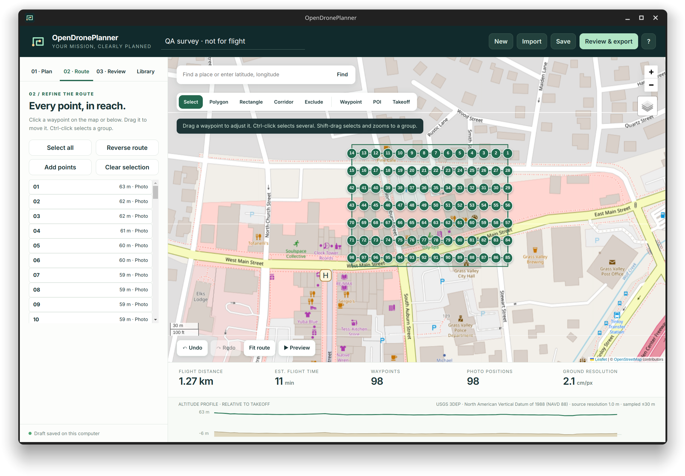
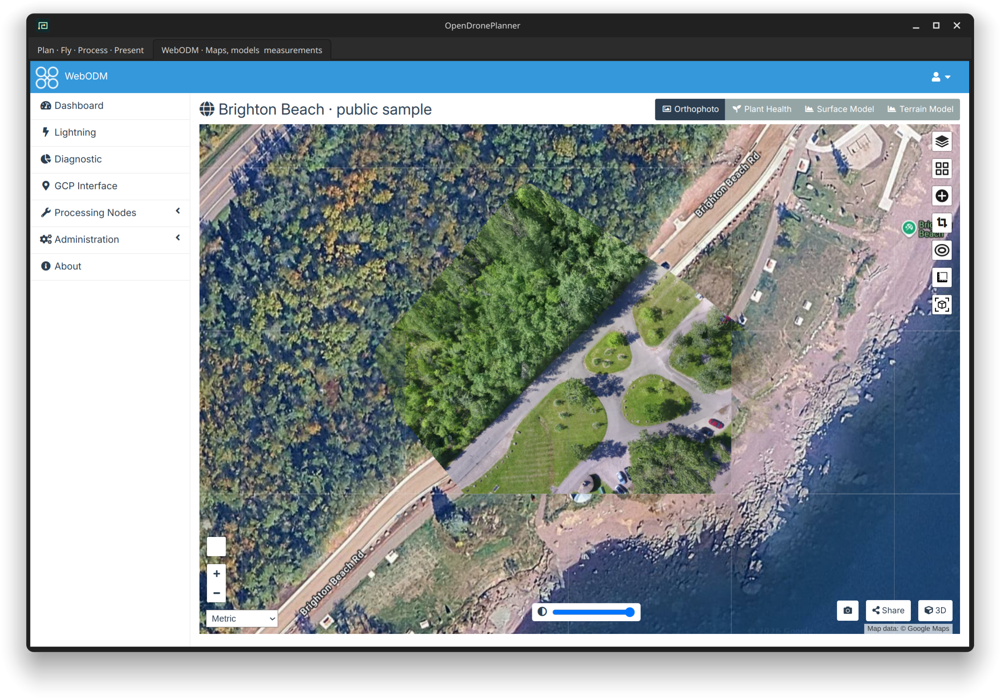
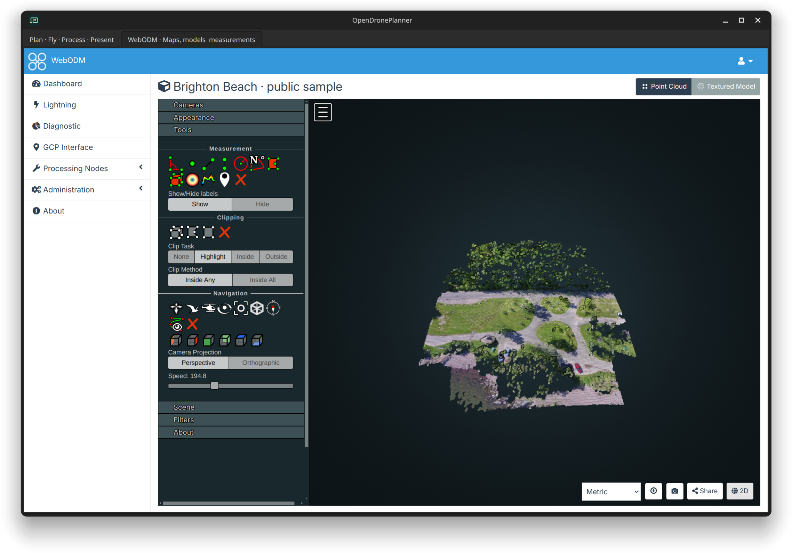

# OpenDronePlanner (ODP)

A free desktop app for planning drone flights, exporting DJI missions, processing captured imagery with ODX/WebODM, and preparing maps, models and reports. Your projects and processing stay on your computer. No ODP account or subscription.

**Plan flight → Export & controller → Process & present**. The original Waypoint Transfer utility remains available for unchanged KMZ installation.

[Download the desktop app](https://github.com/nfredmond/OpenDronePlanner/releases/latest) · [Installation guide](docs/DISTRIBUTION.md) · [Processing guide](docs/PROCESSING.md)

| Computer | Installer |
|---|---|
| Windows 10/11, x64 | [Setup EXE](https://github.com/nfredmond/OpenDronePlanner/releases/latest/download/OpenDronePlanner-Windows-x64-Setup.exe) |
| Mac, Apple Silicon | [ARM64 DMG](https://github.com/nfredmond/OpenDronePlanner/releases/latest/download/OpenDronePlanner-macOS-arm64.dmg) |
| Mac, Intel | [Intel DMG](https://github.com/nfredmond/OpenDronePlanner/releases/latest/download/OpenDronePlanner-macOS-x64.dmg) |
| Ubuntu 24.04+ / compatible Debian, x64 | [DEB package](https://github.com/nfredmond/OpenDronePlanner/releases/latest/download/OpenDronePlanner-Linux-x64.deb) |

Install the app, then open OpenDronePlanner from its shortcut or application menu. Python, Node and Git are bundled or unnecessary. The app never adds itself to login startup. Closing its window stops its local services; it asks you to finish or cancel active work first.

The installers are unsigned, so Windows/macOS may require approval to open them. Planning works immediately. Reconstruction additionally requires Docker with Linux containers, installed once. CPU is the default; NVIDIA CUDA is optional. Automatic controller replacement currently requires Linux/KDE. Windows and Mac support planning, KMZ export and the processing workspace. See the installation guide for exact requirements and tested boundaries.



## What you can do

- Draw polygons, rectangles, multiple areas, exclusion polygons and corridor centerlines.
- Generate survey grids, crosshatch coverage, corridor surveys and POI orbits.
- Add, drag, reorder, duplicate, reverse and edit individual or grouped waypoints. Undo and redo edits.
- Set camera dimensions, overlap, capture spacing, speed, gimbal pitch, heading, hover time and photo/video actions.
- Choose flight direction or use the longest boundary edge; route survey connectors around exclusions.
- Import DJI KMZ, KML boundaries/routes, GeoJSON or portable ODP projects. Preserve the original KMZ for unchanged transfer.
- Load terrain from USGS 3DEP or a local elevation GeoTIFF. See the ground and flight profile; adjust heights relative to takeoff.
- Save missions and settings presets locally. Drafts survive closing the app.
- Estimate distance, GSD, photo positions and flight time with takeoff/return transit. Split routes by waypoint count and a configurable battery budget.
- Export DJI KMZ, a ZIP of separate flight KMZs, GeoJSON, route KML, waypoint CSV, an ODP project or a printable field brief.
- Preview the path with a moving marker. This is a route animation, not a flight dynamics simulator.
- Back up and replace one DJI Fly flight slot over USB/MTP, verify the copied bytes, and restore on failure.
- Use the same planning engine through a CLI or authenticated loopback API.

## Capture, reconstruct and deliver





These outputs were reconstructed during ODP verification from [Piero Toffanin's public Brighton Beach photos](https://github.com/pierotofy/drone_dataset_brighton_beach). They are not a user flight or an independent accuracy assessment.

- Import photos, videos and matching SRT telemetry, ground control and field records by dropping files or selecting a folder. ODP copies originals, records SHA-256 checksums, and displays readable photo positions.
- Link each capture to a saved flight snapshot or start an independent capture. Keep multiple processing runs and reviewer notes together.
- Choose quick preview, map/elevation, detailed model or multispectral presets. Search and edit all options advertised by the running engine.
- Run the official ODX engine through a dedicated local WebODM stack. Choose CPU threads and optional NVIDIA CUDA. GPU access is checked before startup; only supported reconstruction stages use CUDA.
- Open the full WebODM workspace inside the desktop app for its upstream viewers, processing controls, GCP tools, measurements and exports. Features depend on the imagery, task options and installed upstream version.
- Download actual completed orthomosaics, DSM/DTM, point clouds, textured models, camera records and engine quality reports. Outputs appear when the engine creates them.
- Write findings and limitations, export a printable report, or build a ZIP containing selected processing outputs, checksums, capture manifest and linked flight project.

ODP does not infer survey accuracy from completion, GPS tags or pixel size. It preserves missing evidence and distinguishes a planned route from recorded photo positions. Video, multispectral, thermal and ground-control workflows use upstream capabilities; the verification record identifies which were exercised with real data.

## Install from source on Ubuntu / KDE

Dependencies: Python 3.12+, Node.js supported by Vite 7, npm, uv, and system Qt6 WebEngine. USB integration requires KDE KIO MTP, D-Bus and PyGObject.

On Ubuntu the system packages are `python3-pyqt6.qtwebengine`, `python3-dbus`, `python3-gi`, `kio-extras` and `kdialog`. Install missing packages using your system package manager, then:

```bash
git clone https://github.com/nfredmond/OpenDronePlanner.git
cd OpenDronePlanner
./install.sh
```

The installer creates **OpenDronePlanner** and **Waypoint Transfer** desktop shortcuts. It uses a virtual environment with the system Qt bindings, installs Python geometry dependencies and builds the local web interface. It does not configure login startup.

Open the planner with its icon or `./launch-planner.sh`. The desktop window owns a loopback service on a free port. Closing the window stops that service. It refuses to close during an active USB operation.

For bundled Windows, macOS and Linux releases, use the download links above. The source installer in this section targets Ubuntu/KDE.

## First mission

1. Draw a boundary, add a takeoff point and enter your camera/flight settings. Generate the path.
2. Click or drag waypoints to refine it. Shift-drag selects a group and zooms to it. Add terrain if needed.
3. In **Review**, load an aircraft profile from a known-good DJI KMZ. This does not replace your drawn route. Choose mission completion and signal-loss actions.
4. Resolve red validation messages, export the mission and open it in DJI Fly. Check the route, altitude reference, camera behavior and aircraft acceptance before flying.
5. To install over USB, connect and unlock the controller, select file transfer and save a placeholder waypoint flight in DJI Fly. Use **Review → Connected controller**, or drop an existing KMZ into **Waypoint Transfer**.

The controller installer replaces an existing saved flight, rather than creating a DJI Fly database entry. The displayed thumbnail/name in DJI Fly may remain from that slot.

## Accuracy and compatibility boundaries

Generated KMZs use DJI WPML and preserve the imported aircraft identity. DJI's public WPML documentation primarily covers enterprise aircraft. **Structural checks and successful USB copying do not prove that a consumer aircraft will execute a generated mission correctly.** No aircraft is armed or flown by this application. Firmware-specific DJI Fly acceptance and flight behavior need controller and field verification.

Unrecognized imported actions block rewritten export until explicitly cleared. The original imported KMZ remains available for byte-preserving transfer. Supported gradual gimbal movements are retained. Edited exports are newly generated files, not lossless preservation of every vendor extension.

GSD and overlap estimates assume the camera dimensions entered by the pilot, a nadir view and level ground. Default camera dimensions are planning assumptions, not an automatically identified camera. Terrain is sampled at intervals of at most 30 m along the planned route. It is bare earth, not a tree, wire or obstacle model. Missing terrain blocks terrain-following export; it is never replaced with zero. Local DEM band 1 must contain elevations in meters. USGS coverage and source accuracy vary. Takeoff and terrain must use the same vertical reference for relative-height calculations.

Exclusion checks use straight route segments. Curved turns, takeoff/return behavior, regulatory authorization, live weather, obstacle avoidance and actual battery performance are not certified by the planner. Draw your own clearance buffers and review the actual site. Multi-area transit legs can require manual adjustment.

## Local files and privacy

- Planner missions, presets, drafts, profiles and imported DEMs: `~/.local/share/opendroneplanner/`
- Controller slot identity and verified backup receipts: `~/.local/share/waypoint-transfer/`
- These files are outside the source repository. An ODP project can contain the original imported KMZ, so treat exported projects as flight data.
- Online basemaps contact OpenStreetMap, Esri or USGS. Place search sends the entered query to Nominatim. The USGS terrain button sends route coordinates to the 3DEP service. Local GeoTIFF processing stays on the computer.
- Capture media and manifests: `~/.local/share/opendroneplanner/processing/`. Processing databases and generated products also live in local Docker volumes named `odp-processing_*`. Back up both locations.
- On Windows/macOS the default data folder is also `.local/share/opendroneplanner` within your home folder. `ODP_DATA_DIR` can override it.
- The dedicated WebODM account is generated locally. Its credentials stay in local settings. Engine images download from public registries. WebODM viewers and optional upstream services may contact their map/service providers.
- ODP adds no telemetry or external AI API. Exported reports and archives contain location and media metadata; review them before sharing.

## Development and agents

```bash
npm run build
.venv/bin/python -B -m unittest -v test_planner test_server test_transfer test_mtp test_drop test_processing
.venv/bin/python -B check_planner_mutations.py
.venv/bin/python -B check_mutations.py
.venv/bin/python -B check_processing_mutations.py

# Browser development: explicit server lifetime, no controller access
ODP_DATA_DIR=/tmp/odp-dev .venv/bin/python server.py --port 8765 --offline
```

See [API and CLI](docs/API.md), [feature coverage](docs/FEATURES.md), [verification](docs/VERIFICATION.md), and [agent instructions](AGENTS.md).

## License and acknowledgments

ODP source is MIT. Independent software; not affiliated with DJI or WaypointMap. WebODM/ODX run as separate official containers under their own licenses. Bundled Qt/Python/GIS libraries retain their licenses. See [third-party notices](docs/THIRD_PARTY.md) and [sources](docs/SOURCES.md). Map data and imagery retain provider attribution and terms.
